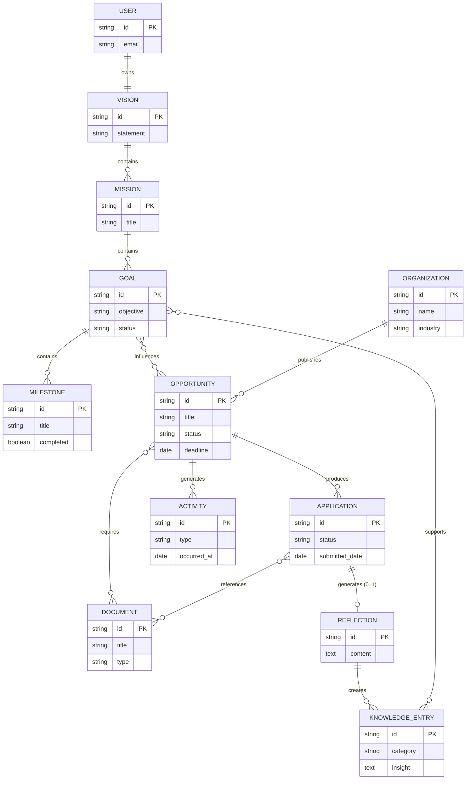

# CareerOS Entity Relationship Diagram (ERD)

**File:** `docs/03-domain/erd.md`

---

# Entity Relationship Diagram

**Status:** Canonical
**Version:** 1.0

---

## Purpose
This document provides a visual representation of the domain entities and their relationships as defined in `entities.md`. It uses Mermaid syntax to generate the diagram, illustrating the structural cardinality and relationships between Aggregates.

*Note: This is a semantic domain model ERD, not a strict database schema diagram. It describes conceptual relationships, not foreign keys or join tables.*

---

## The CareerOS Domain Model

---

## Aggregate Boundaries

When implementing this ERD, remember the boundaries defined by the **Domain Context Map**:

1. **Strategy Context** (`VISION`, `MISSION`, `GOAL`, `MILESTONE`): Owns the long-term career trajectory.
2. **Opportunity Context** (`ORGANIZATION`, `OPPORTUNITY`, `APPLICATION`, `ACTIVITY`): Owns the execution pipeline of specific roles or grants.
3. **Knowledge Context** (`DOCUMENT`, `REFLECTION`, `KNOWLEDGE_ENTRY`): Owns the compounding career capital and reusable assets.

Relationships that cross these context boundaries (e.g., `GOAL` influencing `OPPORTUNITY`, or `KNOWLEDGE_ENTRY` supporting `GOAL`) are typically implemented as loose references (IDs) rather than strong database foreign keys, allowing the contexts to evolve independently.
