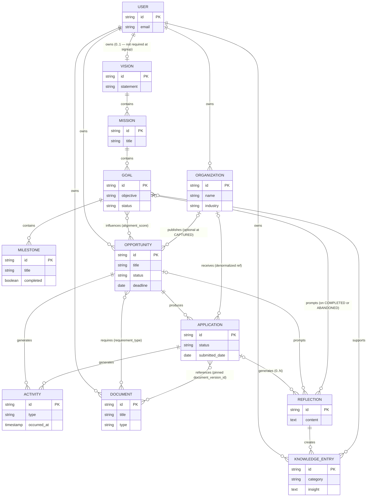

# CareerOS Entity Relationship Diagram (ERD)

**File:** `docs/03-domain/erd.md`

---

# Entity Relationship Diagram

**Status:** Canonical (scoped — see §Scope)
**Version:** 1.1 (supersedes 1.0)

---

## Purpose
This document provides a visual representation of the domain entities and their relationships as defined in `entities.md`. It uses Mermaid syntax to generate the diagram, illustrating the structural cardinality and relationships between Aggregates.

*Note: This is a semantic domain model ERD, not a strict database schema diagram. It describes conceptual relationships, not foreign keys or join tables.*

---

## Scope

**v1.1 covers the career spine:** the Strategy, Opportunity, and Knowledge contexts, plus cross-cutting `ACTIVITY`.

The following entities from the Core Entity Map (`domain-model.md` §3) are **deliberately deferred to v1.2+** and their absence here is not a statement that they do not exist:

| Deferred Entity | Target Context | Reason for Deferral |
|---|---|---|
| `TASK` | Opportunity | Lifecycle not yet ratified in `state-machines.md` |
| `CALENDAR_EVENT` | Integration | Owned by Integration Context spec |
| `REMINDER` | Integration | Owned by notifications spec |
| `NOTIFICATION` | Platform | Platform service, not career domain |
| `DECISION_JOURNAL` | Knowledge | Reflection linkage pending design |
| `CAREER_CAPITAL` | Strategy | Derived/computed; storage strategy TBD |
| `CONTACT` | Opportunity (Organization) | CRM design pending |
| `TEMPLATE` | Knowledge | Document versioning design lands first |
| `AI_INSIGHT` | Knowledge / Automation | Provenance model TBD |
| `SETTINGS` | Platform | Platform service |

---

## Tenancy (Ownership) Convention

**Every aggregate is User-scoped.** The diagram draws explicit ownership edges from `USER` to the six aggregate roots identified in `entities.md` §3. Child entities inherit tenancy transitively:

- `MISSION`, `GOAL`, `MILESTONE` inherit via `VISION`
- `APPLICATION`, `ACTIVITY` inherit via `OPPORTUNITY`
- `REFLECTION` inherits via its parent (`APPLICATION` / `OPPORTUNITY` / `GOAL`)

This is the authorization boundary: every query and permission check resolves through `USER`. Never treat an aggregate as globally addressable.

---

## The CareerOS Domain Model

**Status enums:** `OPPORTUNITY.status`, `APPLICATION.status`, and `GOAL.status` are canonical in `state-machines.md` (Opportunity: CAPTURED/EVALUATING/ACTIONED/ARCHIVED; Application: DRAFTING/SUBMITTED/INTERVIEWING/OFFER_RECEIVED/ACCEPTED/DECLINED/REJECTED/WITHDRAWN; Goal: DRAFT/ACTIVE/COMPLETED/ABANDONED). This ERD does not redefine them.

---

## Link Payload Table (N:N Relationships)

Every N:N relationship is a first-class link with attributes. Do **not** implement these as bare join tables.

| Link | Payload | Why It Matters |
|---|---|---|
| `GOAL` ↔ `OPPORTUNITY` | `alignment_score`, `linked_at`, `linked_by` (user or AI) | Feeds the Opportunity Score and Strategic Alignment computed properties |
| `OPPORTUNITY` ↔ `DOCUMENT` | `requirement_type` (required / optional), `notes` | Drives preparation checklists and Readiness Score |
| `APPLICATION` ↔ `DOCUMENT` | **`document_version_id` (immutable pin, per INV-008)**, `attached_at` | Answers "which exact version of my CV did I submit?" — submission provenance must survive later edits to the Document head |
| `KNOWLEDGE_ENTRY` ↔ `GOAL` | `provenance_note`, `linked_at` | Knowledge Entries never lose provenance (INV-005) |

---

## Aggregate Boundaries

When implementing this ERD, remember the boundaries defined by the **Domain Context Map**:

1. **Strategy Context** (`VISION`, `MISSION`, `GOAL`, `MILESTONE`): Owns the long-term career trajectory.
2. **Opportunity Context** (`ORGANIZATION`, `OPPORTUNITY`, `APPLICATION`, `ACTIVITY`): Owns the execution pipeline of specific roles or grants.
3. **Knowledge Context** (`DOCUMENT`, `REFLECTION`, `KNOWLEDGE_ENTRY`): Owns the compounding career capital and reusable assets.

Relationships that cross these context boundaries (e.g., `GOAL` influencing `OPPORTUNITY`, or `KNOWLEDGE_ENTRY` supporting `GOAL`) are implemented as loose references (IDs) rather than strong database foreign keys, allowing the contexts to evolve independently.

`ACTIVITY` is the exception that proves the rule: it is a cross-context, append-only observer (INV-004, INV-010). The two edges drawn above are illustrative — any aggregate may generate Activities, and Activities are never mutated or hard-deleted.

---

## Changelog

**v1.1 (current)** — Principal SWE review fixes applied:
- Added `USER` ownership edges to all aggregate roots; documented transitive tenancy. `USER`–`VISION` relaxed to 0..1 (Vision is not required at signup).
- Added Scope statement covering the 10 deferred entities.
- Added `ORGANIZATION` → `APPLICATION` denormalized reference for per-organization analytics.
- Made `ORGANIZATION` optional for `OPPORTUNITY` (unknown at CAPTURED per `state-machines.md`).
- Relaxed `APPLICATION` → `REFLECTION` from 0..1 to 0..N; added `REFLECTION` links to `OPPORTUNITY` and `GOAL` per `domain-model.md` §11.
- Added Link Payload Table; `APPLICATION` ↔ `DOCUMENT` now pins immutable `document_version_id` (INV-008).
- `ACTIVITY.occurred_at` changed from `date` to `timestamp`; documented Activity as cross-context observer.
- Added status-enum pointer to `state-machines.md`.

**v1.0** — Initial diagram from `entities.md` §9 Cardinality Matrix.

---

## Open Items for v1.2

1. Model `DECISION_JOURNAL` and its `REFLECTION` linkage.
2. Model `TASK`, `CONTACT`, and `TEMPLATE` once their lifecycles are ratified.
3. Decide `CAREER_CAPITAL` representation (derived view vs. materialized aggregate).
4. Resolve governance: this ERD is Canonical while its source (`domain-model.md`) remains Draft — promote `domain-model.md` or downgrade this doc's status.
