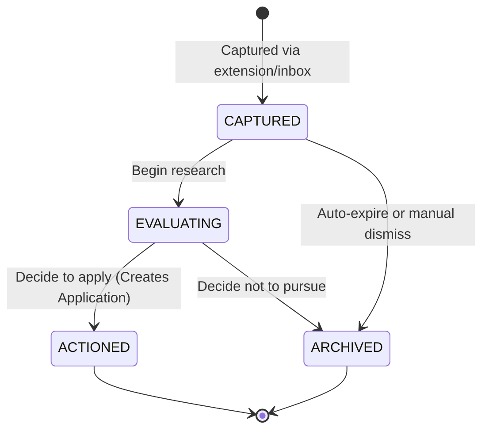
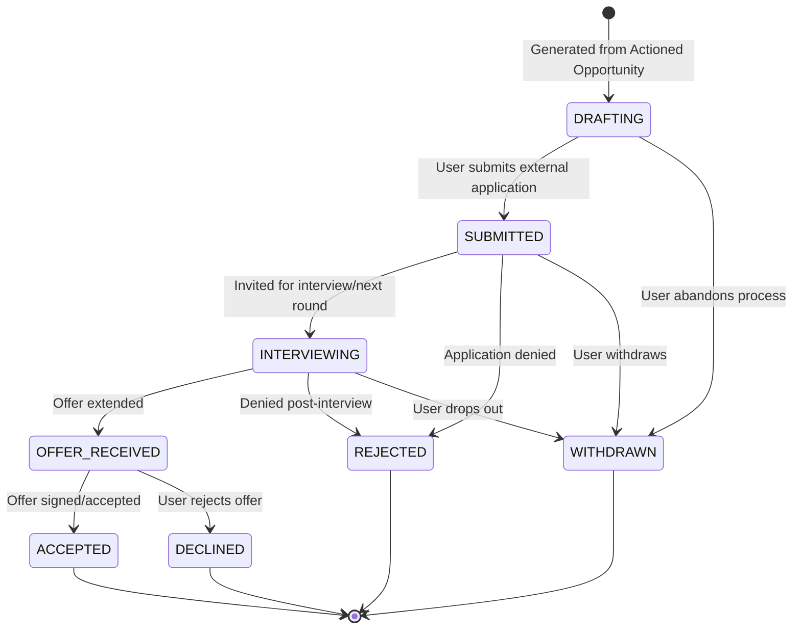
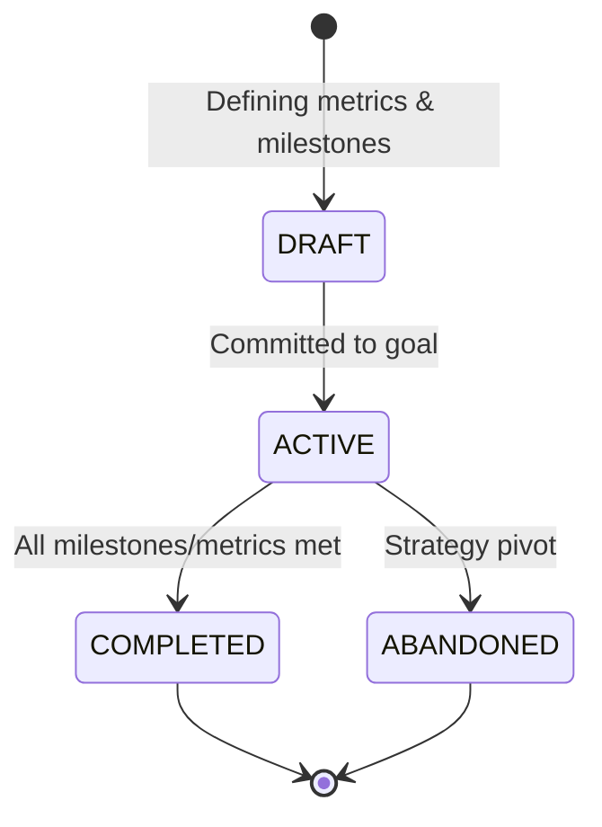

# Domain State Machines

**File:** `docs/03-domain/state-machines.md`

---

# Entity State Machines

**Status:** Canonical
**Version:** 2.0

---

## Purpose

This document defines the strict lifecycle states and valid transitions for the core aggregates in CareerOS. Defining explicit state machines ensures that entities cannot enter invalid states (e.g., an Application cannot be "Accepted" if it hasn't been "Submitted").

**Design Principle:** Opportunity and Application are separate aggregates with independent lifecycles. The Opportunity lifecycle models the **evaluation decision** ("Should I pursue this?"). The Application lifecycle models the **execution tracking** ("How am I pursuing this?"). This separation follows DDD Bounded Context principles and ensures each entity has a single, clear responsibility.

---

## 1. Opportunity Lifecycle

An `Opportunity` represents a potential path (a job, grant, scholarship, etc.). Its lifecycle is about **capture, evaluation, and decision**. The Opportunity does NOT track submission, interviews, or outcomes — those belong to the Application.

### State Definitions

| State | Description | Entry Conditions | Exit Conditions |
|-------|-------------|------------------|-----------------|
| **CAPTURED** | Raw entry point. Minimal data required. Opportunity has been captured but not yet evaluated. | Created via extension, inbox, or manual entry | User begins active research OR auto-archive timeout |
| **EVALUATING** | User is actively scoring this against their Goals (Strategy Context). Research, comparison, and decision-making happen here. | User explicitly starts evaluation | Decision made: pursue (→ ACTIONED) or abandon (→ ARCHIVED) |
| **ACTIONED** | Terminal state. User has decided to pursue this opportunity. An Application entity is automatically created. | User clicks "Action" or "Apply" | Never (terminal) |
| **ARCHIVED** | Soft-deleted. Can be revived later but does not show in active pipelines. Includes expired, dismissed, and abandoned opportunities. | Manual dismiss, auto-expire, or strategic rejection | Never (terminal, but revocable) |

### Transition Rules

| From | To | Trigger | Side Effects |
|------|-----|---------|--------------|
| *(new)* | CAPTURED | Opportunity created via any capture method | AI extraction begins (async). Organization entity linked or created. |
| CAPTURED | EVALUATING | User opens Opportunity and clicks "Start Evaluation" | Scoring dimensions initialized. Strategy Context (active Goals) loaded. |
| CAPTURED | ARCHIVED | Auto-expire (30 days, no deadline) OR manual dismiss | Toast notification with undo. Analytics updated. |
| EVALUATING | ACTIONED | User clicks "Action" or "Apply" | **Application entity created** in DRAFTING state. Opportunity score recorded. Tasks generated from requirements. |
| EVALUATING | ARCHIVED | User clicks "Not Now" or "Skip" | Reason logged (optional). Analytics updated. |
| ARCHIVED | CAPTURED | User revives from Archive | Returns to CAPTURED for re-evaluation. |

### Domain Rules

- **OP-001**: An Opportunity in CAPTURED state for >30 days without a deadline auto-transitions to ARCHIVED (with undo notification).
- **OP-002**: ACTIONED requires at least one active Goal in the Strategy Context for scoring alignment.
- **OP-003**: An Opportunity can only have ONE active Application at a time. Creating a second Application for the same Opportunity is blocked.
- **OP-004**: ARCHIVED Opportunities remain searchable and visible in "All Opportunities" with archived filter.
- **OP-005**: The Opportunity score is locked when transitioning to ACTIONED and stored in the historical record.

---

## 2. Application Lifecycle

The `Application` is the execution engine. It tracks the actual work done to pursue an Actioned Opportunity. The Application lifecycle covers **preparation, submission, and outcome tracking**.

### State Definitions

| State | Description | Entry Conditions | Exit Conditions |
|-------|-------------|------------------|-----------------|
| **DRAFTING** | Application exists. User is preparing deliverables (essays, CV, documents). | Created automatically when Opportunity transitions to ACTIONED | All required deliverables complete AND user clicks "Submit" OR user abandons |
| **SUBMITTED** | Application officially delivered to organization. Submission timestamp locked. System schedules follow-up reminders. | User clicks "Submit" after completing deliverables | Organization responds (→ INTERVIEWING or REJECTED) OR user withdraws |
| **INTERVIEWING** | Interview process active. May span multiple rounds. Generates Activity records for each interview. | Organization invites candidate | Offer extended (→ OFFER_RECEIVED) OR rejected (→ REJECTED) OR user withdraws |
| **OFFER_RECEIVED** | Positive decision received. Pending user acceptance. | Organization extends offer | User accepts (→ ACCEPTED) OR declines (→ DECLINED) |
| **ACCEPTED** | Terminal state. Offer signed/accepted. Triggers celebration, reflection prompt, and Career Capital update. | User accepts offer | Never (terminal) |
| **REJECTED** | Terminal state. Application denied by organization. Triggers reflection prompt. | Organization rejects application | Never (terminal) |
| **DECLINED** | Terminal state. User actively rejects an offer. Triggers reflection prompt. | User declines offer | Never (terminal) |
| **WITHDRAWN** | Terminal state. User abandons the application process at any point. Historical data preserved. | User clicks "Withdraw" at any stage | Never (terminal) |

### Transition Rules

| From | To | Trigger | Side Effects |
|------|-----|---------|--------------|
| *(new)* | DRAFTING | Application created from ACTIONED Opportunity | Documents linked. Tasks generated. Deliverables initialized. |
| DRAFTING | SUBMITTED | User clicks "Submit" after completing all required deliverables | Submission timestamp locked. Preparation metrics frozen. Follow-up reminders scheduled. |
| DRAFTING | WITHDRAWN | User clicks "Withdraw" or "Abandon" | Historical data preserved. Analytics updated. |
| SUBMITTED | INTERVIEWING | Organization invites for interview/next round | Interview Activity generated. Calendar event created. |
| SUBMITTED | REJECTED | Application denied by organization | Reflection prompt triggered. Feedback recorded. Analytics updated. |
| SUBMITTED | WITHDRAWN | User withdraws after submission | Historical data preserved. |
| INTERVIEWING | OFFER_RECEIVED | Organization extends offer | Offer details recorded. Deadline set for response. |
| INTERVIEWING | REJECTED | Denied post-interview | Reflection prompt triggered. Interview feedback recorded. |
| INTERVIEWING | WITHDRAWN | User drops out of interview process | Historical data preserved. |
| OFFER_RECEIVED | ACCEPTED | User signs/accepts offer | **Celebration activity generated.** Preparation tasks archived. Career Capital updated. Reflection prompt triggered. |
| OFFER_RECEIVED | DECLINED | User rejects offer | Reflection prompt triggered. Reason recorded (optional). |
| REJECTED | *(terminal)* | — | Reflection prompt. Analytics updated. |
| ACCEPTED | *(terminal)* | — | Celebration. Career Capital update. Reflection prompt. |
| DECLINED | *(terminal)* | — | Reflection prompt. Analytics updated. |
| WITHDRAWN | *(terminal)* | — | Historical data preserved. |

### Domain Rules

- **APP-001**: DRAFTING requires at least one linked Document or Deliverable before SUBMITTED is allowed.
- **APP-002**: SUBMITTED locks the submission timestamp and prevents further document edits (read-only for preparation artifacts).
- **APP-003**: INTERVIEWING generates an Activity record for each interview round (e.g., "Phone Screen", "Technical Interview", "Final Round").
- **APP-004**: Entering ACCEPTED, REJECTED, or DECLINED **must** prompt the user to generate a Reflection (Knowledge Context) to ensure Knowledge Compounding.
- **APP-005**: WITHDRAWN can be triggered from any non-terminal state. The user is asked for a reason (optional) before confirmation.
- **APP-006**: The Application timeline view shows all state transitions with timestamps for full audit trail.

---

## 3. Goal Lifecycle

A `Goal` defines the strategic direction. Goals in the ACTIVE state influence the scoring of Opportunities during the EVALUATING phase.

### State Definitions

| State | Description | Entry Conditions | Exit Conditions |
|-------|-------------|------------------|-----------------|
| **DRAFT** | Goal is being defined. Metrics and milestones are being set. | Created by user | User commits to goal |
| **ACTIVE** | Goal is live and influences Opportunity scoring. Milestones are being tracked. | User clicks "Commit" | All milestones met (→ COMPLETED) OR strategy pivot (→ ABANDONED) |
| **COMPLETED** | Terminal state. All milestones and metrics satisfied. Archived for historical review. | All milestones marked complete | Never (terminal) |
| **ABANDONED** | Terminal state. Strategy pivot or deprioritization. Triggers high-level Career Reflection. | User abandons goal | Never (terminal, but revocable) |

### Domain Rules

- **GOAL-001**: ACTIVE Goals directly influence the Opportunity Score during the EVALUATING phase (Strategic Alignment dimension).
- **GOAL-002**: A Goal must have at least one Milestone before transitioning to ACTIVE.
- **GOAL-003**: COMPLETED Goals trigger a Career Reflection prompt to capture learnings.
- **GOAL-004**: ABANDONED Goals trigger a Career Reflection prompt to capture the reason for pivot.

---

## 4. Cross-Aggregate Rules

These rules govern how lifecycles interact across aggregates:

| Rule | Description |
|------|-------------|
| **XAG-001** | An Opportunity transitioning to ACTIONED **must** create an Application in DRAFTING state. This is an atomic operation. |
| **XAG-002** | An Application's parent Opportunity must be in ACTIONED state. If the Opportunity is ARCHIVED, the Application cannot exist in a non-terminal state. |
| **XAG-003** | Terminal states on Application (ACCEPTED, REJECTED, DECLINED) trigger a Reflection prompt. This is enforced by the Knowledge Context event handler. |
| **XAG-004** | Goal scoring alignment is read-only during Opportunity EVALUATING. If a Goal changes state during evaluation, the score is NOT recalculated until the next evaluation session. |
| **XAG-005** | Archived Opportunities can be revived to CAPTURED state, but their historical score is discarded. A fresh evaluation is required. |
