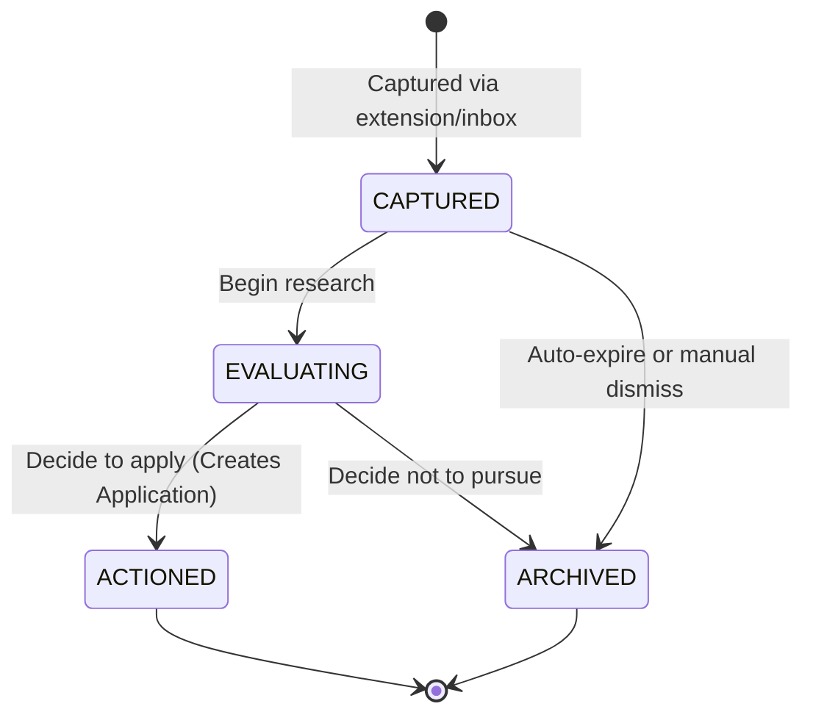
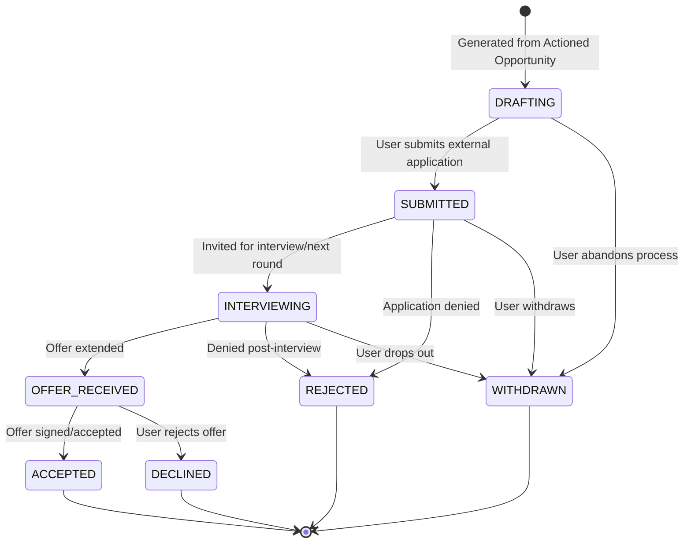
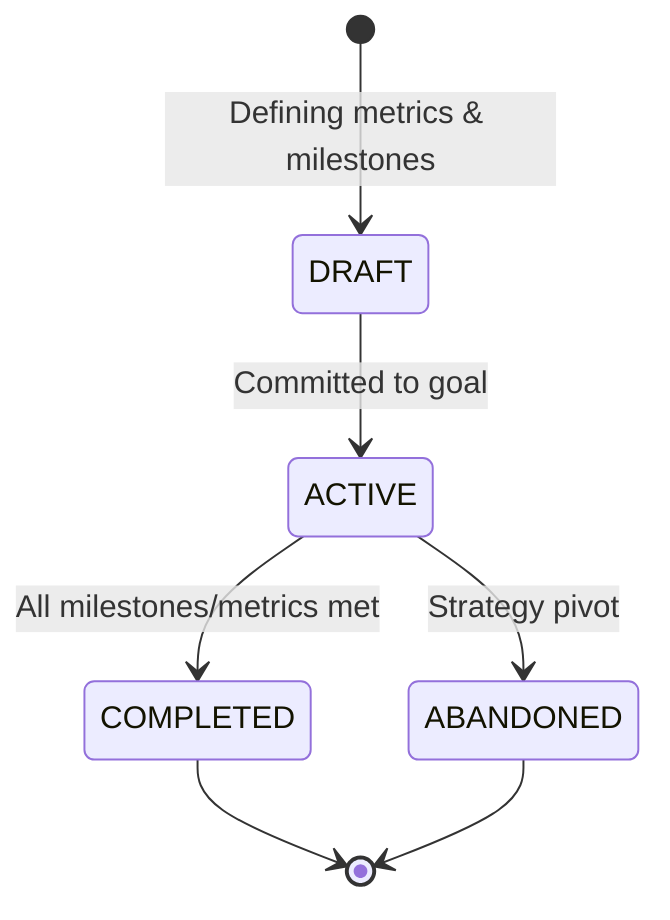

# Domain State Machines

**File:** `docs/03-domain/state-machines.md`

---

# Entity State Machines

**Status:** Canonical
**Version:** 1.0

---

## Purpose
This document defines the strict lifecycle states and valid transitions for the core aggregates in CareerOS. Defining explicit state machines ensures that entities cannot enter invalid states (e.g., an Application cannot be "Accepted" if it hasn't been "Submitted").

---

## 1. Opportunity Lifecycle

An `Opportunity` represents a potential path (a job, grant, scholarship, etc.). Its lifecycle is about capture, evaluation, and decision.

**Domain Rules:**
- **CAPTURED**: The raw entry point. Minimal data is required here.
- **EVALUATING**: The user is actively scoring this against their Goals (Strategy Context).
- **ACTIONED**: A terminal state for the Opportunity itself. Once ACTIONED, the primary lifecycle tracking moves to the child `Application` entity.
- **ARCHIVED**: Soft-deleted. Can be revived later but does not show in active pipelines.

---

## 2. Application Lifecycle

The `Application` is the execution engine. It tracks the actual work done to pursue an Actioned Opportunity.

**Domain Rules:**
- **DRAFTING**: Requires compiling `Documents` and linking `Assets`.
- **SUBMITTED**: The application is out of the user's hands. Triggers follow-up reminders.
- **INTERVIEWING**: Represents any active multi-step process. Generates `Activity` records (e.g., "Technical Interview", "Final Round").
- **Terminal States (REJECTED, ACCEPTED, DECLINED)**: Entering any of these states *must* prompt the user to generate a `Reflection` (Knowledge Context) to ensure Knowledge Compounding.

---

## 3. Goal Lifecycle

A `Goal` defines the strategic direction.

**Domain Rules:**
- **ACTIVE**: Goals in this state actively influence the scoring of `Opportunities` during the EVALUATING phase.
- **COMPLETED/ABANDONED**: Archived for historical review. Entering these states triggers a high-level Career Reflection.
