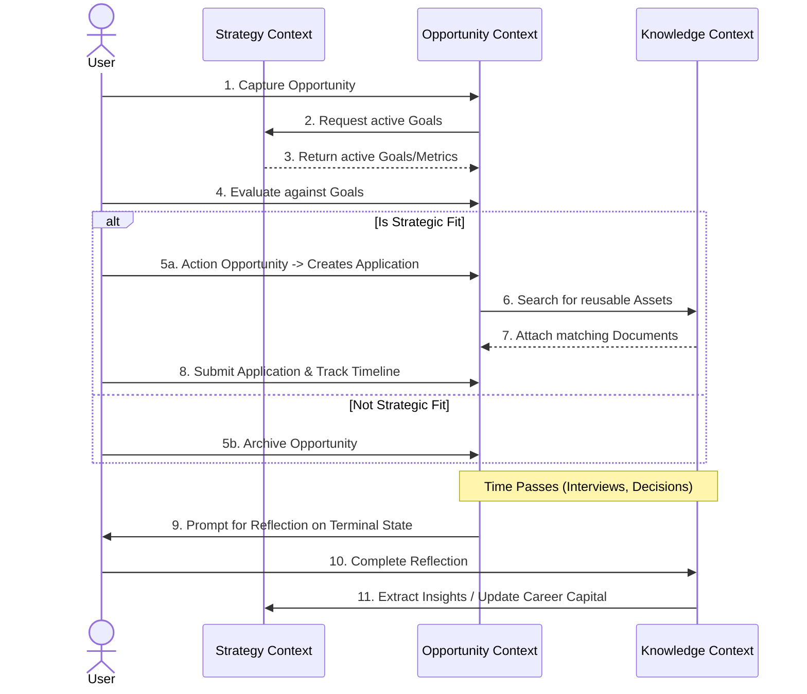
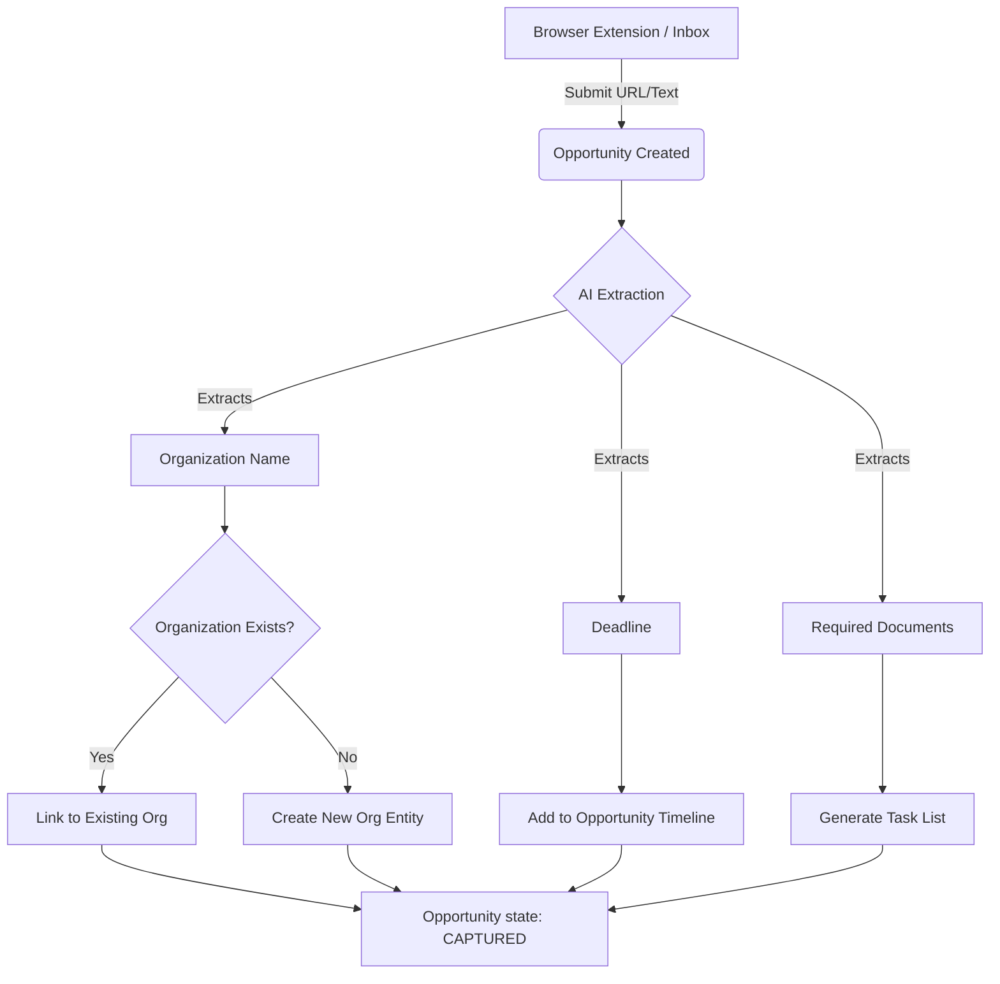
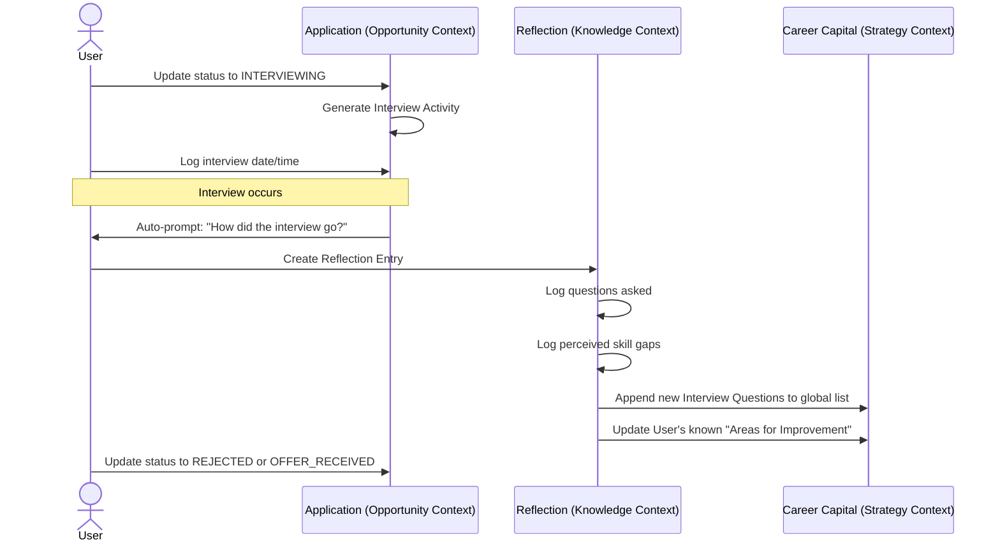

# Domain Workflows

**File:** `docs/03-domain/workflows.md`

---

# Domain Workflows

**Status:** Canonical
**Version:** 1.0

---

## Purpose
While the ERD defines static structural relationships and State Machines define internal entity lifecycles, **Workflows** define how entities interact across time. This document maps out the specific multi-aggregate sequences that drive CareerOS.

---

## 1. The Core Loop (End-to-End Journey)

This is the high-level representation of the CareerOS philosophy: turning an isolated opportunity into compounding career capital.

---

## 2. Capture & Enrichment Workflow

Focuses on what happens the moment a user discovers a new opportunity on the web. It emphasizes automation and reducing the user's cognitive load (Product Principle P-002: Capture First, Organize Later).

---

## 3. The Interview & Reflection Workflow

Focuses on the transformation of an experience into reusable knowledge (Product Principle P-006: Knowledge Compounds).

---

## Domain Enforcement Rules

For engineering implementation, these workflows dictate specific architectural constraints:
1. **Context Isolation**: The Opportunity Context cannot directly modify Career Capital. It must emit an event (e.g., `ReflectionCompleted`) that the Strategy Context listens to.
2. **Asynchronous Enrichment**: AI Extraction during the Capture Workflow must be asynchronous. The user should instantly see the `CAPTURED` Opportunity while extraction runs in the background.
3. **Mandatory Triggers**: The system *must* automatically transition to the Reflection phase upon an Application reaching a terminal state. Relying on the user to manually navigate to a "Reflection" screen violates the core loop.
