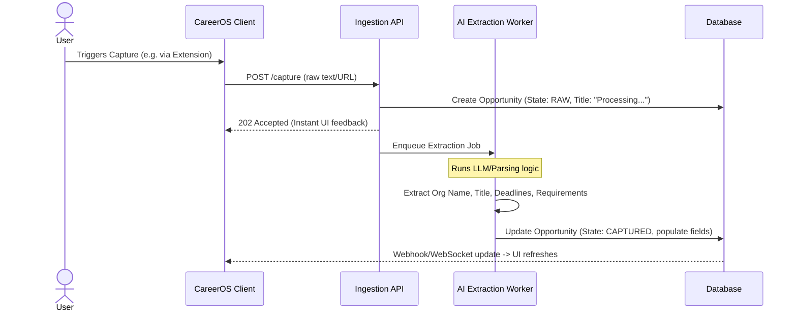

# Capture Flow Specification

**File:** `docs/04-automation/capture-flow.md`

---

# Opportunity Capture Flow

**Status:** Canonical
**Version:** 1.0

---

## Purpose
In accordance with **P-002: Capture First, Organize Later**, the Capture Flow is the most critical ingestion point of CareerOS. Users discover opportunities in highly fragmented environments (LinkedIn, company portals, email newsletters). The Capture Flow must require near-zero cognitive load, instantly ingesting the data and deferring organization to the system.

---

## 1. Entry Points

Opportunities can enter CareerOS through three primary channels:

### A. The Browser Extension (Primary)
- **Action:** User clicks the CareerOS extension while viewing a job description or grant page.
- **Payload:** URL, Page Title, and the raw DOM text of the main content area.
- **UX:** A lightweight slide-out or popup confirming "Opportunity Captured" in < 1 second. No mandatory form filling.

### B. Email Forwarding (Secondary)
- **Action:** User forwards a newsletter or recruiter email to a personalized address (e.g., `inbox@careeros.com`).
- **Payload:** Email Subject, Sender, and Body Text.
- **UX:** Silent backend processing. User sees the opportunity in their "Inbox" upon next login.

### C. Manual Entry (Fallback)
- **Action:** User clicks "New Opportunity" in the CareerOS dashboard.
- **Payload:** User pastes a URL or raw text block.
- **UX:** Immediate asynchronous parsing.

---

## 2. The Asynchronous Extraction Pipeline

To ensure the capture experience is instantaneous, heavy parsing is deferred to an asynchronous background worker.

---

## 3. Data Extraction Rules

The AI Extraction Worker attempts to map unstructured text into the `Opportunity` domain model.

| Target Field | Extraction Logic / Fallback |
| :--- | :--- |
| **Organization Name** | Derived from text context or URL domain. If unknown, leave blank. |
| **Role / Title** | Extracted from page headers or email subjects. Fallback: "Untitled Opportunity". |
| **Deadline** | Semantic date extraction (e.g., "Closes next Friday" -> calculated date). |
| **Required Documents** | Array of strings (e.g., "Resume", "Cover Letter", "Transcripts"). |
| **Source URL** | Saved exactly as captured for provenance. |

---

## 4. Deduplication & Conflict Resolution

Users will frequently capture the same opportunity twice (e.g., seeing it on LinkedIn, and later via an email newsletter).

**Rule: Never drop data silently.**
1. When the Worker processes an opportunity, it compares the extracted `Organization` + `Role` + `URL` against active opportunities.
2. If a match is found (Similarity > 90%):
   - The system flags the new capture as a **Potential Duplicate**.
   - It is appended to the existing Opportunity as an "Additional Source" rather than overwriting existing data.
   - The user is notified in their Inbox view: *"We merged a duplicate capture into [Opportunity Name]."*

---

## 5. The Inbox Review (Trust & Explainability)

Following **P-016 (Explain Before You Automate)**, the system does not automatically start creating Applications or Tasks immediately upon capture. 

1. Processed opportunities land in the user's **Inbox** view.
2. They possess the state `CAPTURED`.
3. The UI highlights the fields that were automatically extracted by AI (e.g., using a subtle visual indicator like a sparkle icon).
4. **User Action:** The user reviews the extracted data, corrects any mistakes (which trains the system), and clicks **"Evaluate"** or **"Action"** to officially move it into their active pipeline.

This step is critical: it guarantees the user retains ultimate authority over their data before any downstream automations fire.
